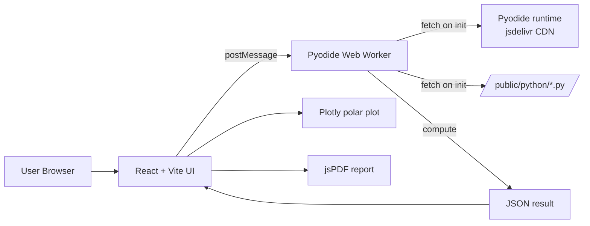

# Antenna Calculator — Project Overview

A comprehensive technical reference for the Antenna Calculator web application. Intended as a self-contained briefing document suitable for generating reports, presentations, archives, and other derivative materials.

---

## 1. Executive Summary

**Antenna Calculator** is a browser-based engineering tool that computes the electrical parameters of four common antenna types — short dipole, small loop, Yagi-Uda array, and quarter-wave monopole — entirely client-side. There is no backend server; all numerical work runs in the browser using Pyodide (Python compiled to WebAssembly), letting the calculator reuse the exact same Python code that the team developed for desktop/CLI use.

The project was developed in partial fulfillment of the requirements for **ECE 325 — Transmission Media & Antenna Systems**, Third Year Section ECE 3A, Bachelor of Science in Electronics Engineering, Academic Year 2025–2026, at the **University of Science and Technology of Southern Philippines (USTP)**.

| Attribute | Value |
|---|---|
| Project name | Antenna Calculator |
| Repository | https://github.com/VillaErnest/antenna-calculator |
| Live demo | Hosted on Netlify (Vite SPA build) |
| Course | ECE 325 — Transmission Media & Antenna Systems |
| Institution | University of Science and Technology of Southern Philippines |
| Section / Program | ECE 3A · BS ECE |
| Academic year | 2025–2026 |
| Lead developer | Villacorta, Ernest Louis |
| Calculators | 4 (Short Dipole, Loop, Yagi-Uda, Quarter-Wave Monopole) |

---

## 2. Project Goals

1. **Single source of truth.** Each calculator's physics formulas live in one Python file, used both by a CLI and by the web UI. No duplicated math logic.
2. **No backend.** Everything runs in the user's browser — easy to host, deploy, and archive.
3. **Educational clarity.** Inputs, outputs, and radiation patterns are presented in a way that maps directly to course concepts (radiation resistance, directivity, efficiency, gain, effective area, etc.).
4. **Reproducibility.** Each calculation can be exported as a PDF report.
5. **Consistent UX.** All four calculators share the same input → results → polar pattern layout, dark/light theme, and PDF export flow.

---

## 3. Architecture at a Glance



- The React UI never imports Python directly; it talks to a single Web Worker over `postMessage`.
- On first load, the worker downloads Pyodide (~10–15 MB, including numpy + scipy) from `cdn.jsdelivr.net` and fetches the four Python calculator files from `/python/`.
- Each compute call serialises a JS object to a Python dict (`to_py()`), runs `module.compute(**payload)`, and returns the result as JSON-friendly data.

---

## 4. Technology Stack

| Layer | Technology | Notes |
|---|---|---|
| Build tool | **Vite 5** | Fast dev server, ES module bundling |
| UI framework | **React 18 + TypeScript** | Functional components, hooks |
| Styling | **Tailwind CSS** + shadcn-style primitives | Custom `Button`, `Card`, `Input`, `Tabs`, etc. in `web/src/components/ui/` |
| Icons | **lucide-react** | |
| Python runtime | **Pyodide 0.26.4** | Runs in a dedicated Web Worker; preloads `numpy` + `scipy` |
| Charts | **Plotly.js** (`react-plotly.js` + `plotly.js-dist-min`) | Native polar plots for radiation patterns |
| PDF export | **jsPDF** + **jspdf-autotable** | Client-side PDF generation |
| Toast/notifications | Custom lightweight implementation | `web/src/components/ui/toast.tsx`, no third-party dep |
| Hosting | **Netlify** | Static publish from `web/dist/` |

CLI dependencies (Python side, optional): `pyperclip` (clipboard), `reportlab` (PDF), both imported lazily so the modules still load in the browser where those libs are unavailable.

---

## 5. Repository Layout

```
antenna-calculator/
├── calculators/                 ← Source-of-truth Python compute modules
│   ├── short_dipole.py
│   ├── loop_antenna.py
│   ├── yagi_uda.py
│   └── monopole.py
├── netlify.toml                 ← Netlify build / headers / SPA redirect config
├── README.md                    ← Short developer-facing readme
├── PROJECT_OVERVIEW.md          ← This document
└── web/                         ← React + Vite front-end
    ├── index.html
    ├── package.json
    ├── vite.config.ts
    ├── tailwind.config.js
    ├── tsconfig*.json
    ├── netlify.toml
    ├── public/
    │   ├── favicon.svg
    │   └── python/              ← Auto-synced from ../calculators/ on dev/build
    │       ├── short_dipole.py
    │       ├── loop_antenna.py
    │       ├── yagi_uda.py
    │       └── monopole.py
    ├── scripts/
    │   └── sync-python.mjs      ← Pre-build hook: copies ../calculators/*.py → public/python/
    └── src/
        ├── main.tsx             ← Entry point (mounts <App/>)
        ├── App.tsx              ← App shell, tab routing, theme toggle, footer, Toaster
        ├── index.css            ← Tailwind base + design tokens (dark/light)
        ├── components/
        │   ├── short-dipole-calculator.tsx
        │   ├── loop-antenna-calculator.tsx
        │   ├── yagi-uda-calculator.tsx
        │   ├── monopole-calculator.tsx
        │   ├── credits-page.tsx
        │   ├── loading-screen.tsx
        │   ├── results-table.tsx
        │   ├── runtime-status.tsx
        │   └── ui/
        │       ├── button.tsx
        │       ├── card.tsx
        │       ├── input.tsx
        │       ├── label.tsx
        │       ├── select.tsx
        │       ├── tabs.tsx
        │       └── toast.tsx
        ├── lib/
        │   ├── pyodide-context.tsx  ← React context wrapping the worker
        │   ├── use-pyodide.ts       ← Worker bootstrap + request/response plumbing
        │   ├── use-theme.ts         ← Persistent dark/light theme hook
        │   ├── utils.ts             ← Helpers (`cn`, `formatNumber`, …)
        │   └── worker-protocol.ts   ← Shared types between worker and UI
        └── workers/
            └── pyodide.worker.ts    ← Loads Pyodide, fetches Python modules, runs compute()
```

---

## 6. How Python and JavaScript Talk to Each Other

1. **Build time.** `npm run dev` and `npm run build` first run `npm run sync-python`, which executes `web/scripts/sync-python.mjs` and copies `calculators/*.py` into `web/public/python/`.
2. **Worker boot.** `web/src/workers/pyodide.worker.ts`:
   - Loads `pyodide.js` from `https://cdn.jsdelivr.net/pyodide/v0.26.4/full/pyodide.js`.
   - Calls `loadPyodide({ indexURL: ... })`.
   - Loads packages `numpy` and `scipy`.
   - `fetch()`es each of the four Python files from `/python/` and writes them to Pyodide's virtual filesystem.
   - Imports each module and emits `status("module-ready", name)` messages so the UI can light up the corresponding tab.
3. **Compute call.** The UI calls `compute<T>("short_dipole", payload)` (defined in `web/src/lib/use-pyodide.ts`); the worker runs `module.compute(**payload.to_py())` and posts the JSON result back.
4. **Error sanitisation.** Pyodide errors normally include the full Python traceback. The worker's `cleanError()` extracts only the final line (e.g. `Frequency, length and distance must be positive.`) so end users never see a stack trace. Errors are surfaced as toast notifications in the UI.

---

## 7. Per-Calculator Details

### 7.1 Short Dipole Antenna Calculator

**Source:** `calculators/short_dipole.py`

**Physics summary.** A short dipole is a centre-fed straight wire whose total length L is small compared to one wavelength (typically L/λ < 0.1). The current distribution is assumed triangular. The module computes the standard small-dipole quantities:

| Quantity | Formula | Notes |
|---|---|---|
| Wavelength λ | `λ = c / f` | c = 3·10⁸ m/s |
| Radiation resistance Rᵣ | `Rᵣ = 80π² (L/λ)²` | Ω |
| Effective length lₑ | `lₑ = L / 2` | m |
| Radiation efficiency e_cd | `Rᵣ / (Rᵣ + R_L)` | unitless |
| Directivity D₀ | `1.5` (fixed) | dimensionless |
| Gain G | `e_cd · D₀` | linear |
| Effective area A_e | `λ² G / (4π)` | m² |
| Directivity at θ | `D(θ) = 1.5 sin²θ` | |
| Radiated power Pᵣ | `I² Rᵣ` | W |
| Radiation intensity U(θ) | `(3 Pᵣ / 8π) sin²θ` | W/sr |
| Far-field E(θ) | `(60 I lₑ sinθ) / d` | V/m |

**Validation.** Marks the result as `valid` when `L/λ ≤ 0.1`, `warning` when `0.09 ≤ L/λ < 0.1`, otherwise `error`. (Internally tracked, no longer shown as a UI badge.)

**Inputs.** frequency (with unit Hz/kHz/MHz/GHz), length (m/cm/mm), feed current I, loss resistance R_L, observation distance d, observation angle θ, antenna reactance X_A.

**Outputs.** All of the above + a normalised E-plane radiation pattern: `E(θ) = 20·log₁₀|sin θ|` (and a flat H-plane = 0 dB), used to draw the polar plot.

**Contributors.** Balabag, Gaputan, Jarilla, Mino, Roa R.J., Vale.

---

### 7.2 Loop Antenna Calculator

**Source:** `calculators/loop_antenna.py`

**Physics summary.** Calculates the radiation resistance, directivity, and pattern of a circular loop antenna (optionally multi-turn, optionally with magnetic core).

| Quantity | Formula | Notes |
|---|---|---|
| Radiation resistance | `Rᵣ = 320 π⁴ (N μ_r A / λ²)²` where `A = π a²` | Ω |
| Pattern intensity | `U(θ) = J₁(ka sinθ)²` (Bessel function of first kind, order 1) | |
| Directivity D₀ | `D₀ = 4π U_max / ∫∫ U sinθ dθ dφ` (numerically integrated) | linear |
| Efficiency e_cd | `Rᵣ / (Rᵣ + R_L)` | |
| Gain | `e_cd · D₀` | |
| dB conversion | `10·log₁₀(·)` | |

The Bessel function J₁ comes from `scipy.special.j1`. Pattern is computed at 361 angles and the dB pattern is clipped to a minimum of −40 dB for plotting.

**Inputs.** Frequency (MHz), loop radius a (m), number of turns N, effective relative permeability μ_reff, loss resistance R_L (optional).

**Outputs.** Radiation resistance, directivity (linear + dB), pattern arrays (θ in rad + pattern in dB), and — when R_L is provided — loss resistance, efficiency, gain (linear + dB).

**Contributors.** Ampo, Capanang, Ellacone, Emano, Engaño, Gamil, Platitas, Tampos.

---

### 7.3 Yagi-Uda Antenna Calculator

**Source:** `calculators/yagi_uda.py`

**Physics summary.** Solves the Yagi-Uda array as a coupled set of half-wave dipole elements using the **method of moments**:

1. Build an N×N mutual-impedance matrix Z where each element Z_{ij} is computed from a vectorised trapezoidal integration over the wire surfaces (the standard sinusoidal-current approximation). The vectorised integrator replaces `scipy.integrate.quad` so it runs fast inside Pyodide.
2. Drive the array by setting V[driven] = 1 V and solving `Z · I = V`.
3. Input impedance is `Z_in = 1 / I_driven`.
4. Generate E-plane and H-plane patterns at 360 azimuthal angles by superposing each element's pattern × array factor.
5. Compute directivity by numerically integrating the 3-D pattern over a (θ, φ) grid.
6. Apply Ohmic-loss correction to give efficiency, then gain in dBi.

**Inputs.** Frequency (MHz), driven element length, reflector length, list of director lengths, list of element spacings, wire radius (mm), conductor material (sets conductivity σ).

**Outputs.** Input impedance Z_in (real + imag), driven-element current magnitudes, directivity (linear + dBi), gain (dBi), efficiency, plus E-plane and H-plane pattern arrays for the polar plot.

**Material/conductivity table.** Configurable via the material dropdown (copper, aluminium, etc.).

**Contributors.** Cabalo, Ganzan, Hinosolongo, Pasaje, Saludes I., Saludes Z., Tarde.

---

### 7.4 Quarter-Wave Monopole Antenna Calculator

**Source:** `calculators/monopole.py`

**Physics summary.** A quarter-wave monopole over a perfect ground plane is the image-theory complement of a half-wave dipole, with all its radiation resistance and directivity values modified accordingly.

| Quantity | Formula | Notes |
|---|---|---|
| Wavelength | `λ = c / f` | |
| Radiation resistance | `Rᵣ = 40π² (L/λ)²` (half that of a dipole) | Ω |
| Directivity D₀ | `3.28` (≈ 2 × dipole directivity) | linear |
| Pattern factor F(θ) | `|cos((π/2) cos θ) / sin θ|` | |
| Gain | `e_cd · D₀` | |
| Effective area | `λ² G / (4π)` | |
| Beam solid angle Ω_A | `4π / D₀` | sr |
| Radiated power | `I² Rᵣ` | W |
| Radiation intensity | `U(θ) = D Pᵣ F²(θ) / (4π)` | W/sr |
| Far-field E | `E = √(2 η₀ U) / d`, η₀ = 120π | V/m |
| Far-field H | `H = E / η₀` | A/m |

**Validation.** `valid` when `0.2 ≤ L/λ ≤ 0.3`, `warning` if smaller, `error` if larger. (Internally tracked.)

**Inputs.** Frequency (with unit), length (with unit), feed current, loss resistance, observation distance, observation angle θ.

**Outputs.** All quantities above plus a 361-point E-plane pattern in dB (and a flat H-plane).

**Contributors.** Albiso, Casama, Delima, Galceran, Miñoza, Roa J.M., Timogan, Yañez.

---

## 8. User Interface

### 8.1 App shell

`web/src/App.tsx` provides:

- **Header** — branding, dark/light theme toggle, navigation between "Calculators" and "Credits" pages.
- **Tab strip** — one tab per calculator, each tab shows a spinner until its Python module is `module-ready` from the worker.
- **Main content area** — either the selected calculator or the credits page.
- **Footer** —
  - Brand blurb covering all four antenna types.
  - Navigation list (Short Dipole, Loop, Yagi-Uda, Monopole, Credits) — clicking a calculator link switches the active tab and returns from the credits page.
  - Course info block: `ECE 325` highlighted, full course name as subtitle, then `ECE 3A | BS ECE | A.Y. 2025–2026`.
  - Copyright line: "© 2026 Villacorta, Ernest Louis. All rights reserved."
- **Toaster** mounted at the root for error notifications.

### 8.2 Calculator pattern

Each calculator follows the same two-column layout (single-column on mobile):

| Left column | Right column |
|---|---|
| **Inputs** card with a form of parameters and a **Calculate** button (disabled until the Python module is loaded, shows a spinner while running). | **Results** card showing a tabular `ResultsTable`, with **Copy** and **Export PDF** buttons in the card header (visible only after a calculation). |
| | **Radiation Pattern** card with a Plotly polar plot, theme-aware (text/grid colors adapt to dark/light mode via a `useDarkMode` hook + `MutationObserver` on `<html>`'s class list). |

### 8.3 Credits page

`web/src/components/credits-page.tsx`:

- Lists each calculator's contributing team.
- Each section has an **Open →** button that switches the active tab and navigates back to the calculator.
- Ends with a single descriptive paragraph: *"Developed in partial fulfillment of the requirements for ECE 325 — Transmission Media & Antenna Systems, Third Year Section ECE 3A, Bachelor of Science in Electronics Engineering, Academic Year 2025–2026."*

### 8.4 Toast notifications

`web/src/components/ui/toast.tsx` — a custom, dependency-free toast system. Subscriber pattern with module-level state; `toast.error()`, `toast.success()`, `toast.info()` API; configurable duration (0 = persistent). Used for:

- Calculation errors (sanitised, never shows a stack trace).
- Worker initialisation failures (persistent toast).

### 8.5 PDF export

Each calculator's "Export PDF" button uses **jsPDF** + **jspdf-autotable** to render a portrait A4 report containing:

- Title (calculator name in primary brand color).
- A `Parameter / Value / Unit` table built from the same `ResultsTable` rows shown on screen.
- File name: `<calculator>_<timestamp>.pdf` (e.g. `short_dipole_1716885000000.pdf`).

---

## 9. Build, Run, Deploy

### 9.1 Development

```bash
cd web
npm install
npm run dev          # → http://localhost:5173
```

`npm run dev` triggers `predev` → `sync-python` → copies `../calculators/*.py` into `public/python/`.

### 9.2 Production build

```bash
cd web
npm run build        # tsc -b && vite build
```

Output goes to `web/dist/`.

### 9.3 Netlify deployment

`web/netlify.toml` configures:

- Base directory: `web`
- Build command: `npm run build`
- Publish directory: `dist`
- Long cache for `/assets/*` (immutable, 1 year)
- Short cache for `/python/*` (5 minutes — so updates to Python modules don't get stuck)
- SPA fallback redirect: `/* → /index.html` (status 200)

First page load downloads Pyodide + numpy + scipy from `cdn.jsdelivr.net` (~10–15 MB). Subsequent visits use the browser cache.

### 9.4 CLI usage of the Python modules

Each calculator file remains independently runnable:

```bash
python calculators/short_dipole.py
python calculators/loop_antenna.py
python calculators/yagi_uda.py
python calculators/monopole.py
```

`pyperclip` / `reportlab` are only needed for the optional CLI clipboard + PDF export features and are imported lazily.

---

## 10. Notable Engineering Decisions

| Decision | Reason |
|---|---|
| **Pyodide in a Web Worker (not main thread)** | Keeps the UI responsive during the multi-MB runtime download and during long compute calls (e.g. Yagi method-of-moments). |
| **Single Python source of truth in `calculators/`** | Avoids drift between desktop/CLI and web implementations; `sync-python.mjs` keeps `public/python/` mirrored. |
| **Vectorised trapezoidal integration for Yagi** | `scipy.integrate.quad` issues per-point Python callbacks that are very slow inside Pyodide. Vectorised numpy + `np.trapz` is dramatically faster. |
| **Custom toast system** | Avoids pulling in `sonner` / `react-hot-toast` etc. Keeps the dependency footprint small. |
| **Error sanitisation in the worker** | Pyodide raises with the full Python traceback in `err.message`. We strip it down to the final `ExceptionType: message` line before posting to the UI, so end users see only friendly messages. |
| **`MutationObserver` for dark-mode plot colours** | React state doesn't see the `.dark` class toggle directly; observing the `<html>` `class` attribute lets each plot re-render with theme-appropriate text/grid colours. |
| **Plotly over Chart.js** | Native polar (`scatterpolar`) support, well suited to antenna radiation patterns. |
| **Per-calculator file rather than a generic engine** | Each antenna has bespoke physics, validation, and inputs; a generic abstraction would hide the equations students are meant to learn. |

---

## 11. Contributors

### Lead developer

- **Villacorta, Ernest Louis** — Web app design, Python integration, project architecture and deployment.

### Calculator contributing teams

| Calculator | Team |
|---|---|
| Short Dipole | Balabag · Gaputan · Jarilla · Mino · Roa R.J. · Vale |
| Loop Antenna | Ampo · Capanang · Ellacone · Emano · Engaño · Gamil · Platitas · Tampos |
| Yagi-Uda | Cabalo · Ganzan · Hinosolongo · Pasaje · Saludes I. · Saludes Z. · Tarde |
| Quarter-Wave Monopole | Albiso · Casama · Delima · Galceran · Miñoza · Roa J.M. · Timogan · Yañez |

---

## 12. Glossary (Quick Reference)

| Term | Definition |
|---|---|
| **Pyodide** | A port of CPython to WebAssembly that runs in the browser, including support for NumPy, SciPy, etc. |
| **Radiation resistance (Rᵣ)** | Equivalent resistance that accounts for power radiated by the antenna. |
| **Loss resistance (R_L)** | Ohmic losses in the conductor. |
| **Radiation efficiency (e_cd)** | `Rᵣ / (Rᵣ + R_L)`. Ratio of radiated to total power dissipated. |
| **Directivity (D₀)** | Ratio of maximum radiation intensity to that of an isotropic source. |
| **Gain (G)** | `e_cd · D₀`. Realised antenna gain. |
| **Effective area (A_e)** | `λ² G / 4π`. Receiving aperture. |
| **Beam solid angle (Ω_A)** | `4π / D₀`. The "size" of the radiation beam in steradians. |
| **Method of moments** | Numerical method for solving electromagnetic problems by discretising the unknown current into expansion functions and enforcing boundary conditions at sample points. |

---

## 13. Document Metadata

| | |
|---|---|
| Document title | Antenna Calculator — Project Overview |
| Maintainer | Villacorta, Ernest Louis |
| Last regenerated | 2026-05-28 |
| Purpose | Comprehensive reference suitable for derivative documents (reports, presentations, archive READMEs). |
